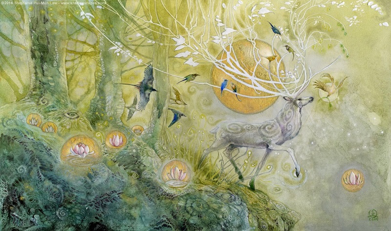
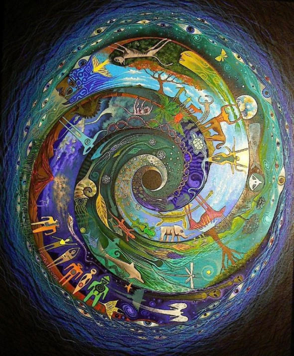
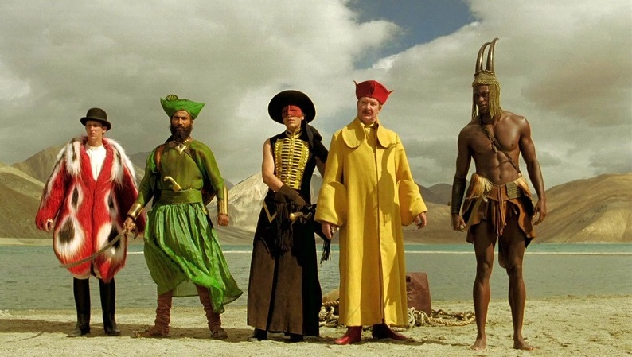

# Благополучное инвестирование

Я попробую воссоздать биржу труда в it-сфере на основе благополучия людей:
1. Доброта
2. Забота



Такое направление будет создавать результат иначе. Например, клавиатура, где буквы у кнопок нажатия динамичны и меняют своё значение при смене раскладки.

> Идеальная политика: многого чего не сделано, будущему поколению есть что продолжить.

Опираться буду на книги Ника Перумова, потому что он пишет про ход времён и подмечает что вечное, а что временное.


По ходу придумывания, данный репозиторий будет наполняться абзацами с названием "мысль №".

### Мысль №1: Востребованность

Время лечит, со временем забудем - мы уже давно про это знаем. Сейчас и учённые занимаются им, назвав время фракталом, а некоторые даже успели его оседлать создав летающие гравицапы. 

В нашем положении мы нацеливаемся на главное, на то, что будет итогом: созданное время, а точнее: благополучные дни. 

У времени для человека есть три точки опоры: прошлое, настоящее и будущее. Прошлое, это то что не поменять? однозначно нет, прошлое это то на что будем опираться. Будущее это изменчивая константа, которая предвещает изменения, и мы пытаемся это новое понять. Настоящее же это точка подпитки, сдесь мы набираем жирок.

Так же мы знаем что у времени есть зоны влияния: весна, лето, осень и зима. И они чередуются. Вместе с чередой у нас три точки опоры так же смещаются, центрируясь настоящим в текущей зоне влияния.



Выводим процесс деятельности в бизнесе:
1. Лето создаёт бизнес.
2. Осень подключает новых людей к бизнесу.
3. Зима оптимизирует бизнес.
4. Весна делает работу в бизнесе.

### Мысль №2: Обслуживание

Когда то у человечества встала проблема, что общинный строй порождает разрушителей общины - дармоедов, даже из таких людей как учённые. Ну потому что в общине нет места для одного человека, возможности подумать наедине, реализовать своё задуманное, адаптироваться к проблемам. В общине каждый влазит со своим без каких либо извини. На помощь пришло обслуживание, разделив работу и личное.



Выводим компоненты идеального обслуживания:
1. Мужская щедрость
2. Женская значимость
3. Женское остепенение
4. Мужской позитив

### Мысль №3: Качества

Со временем человечество наглоталось непослушания и решила, что хватит, и придумала некий стандарт, которого ниже опускаться нельзя, иначе беда. Назовёт такую задумку качеством. С помощью качества мы можем вводить в бизнес деятельность людей и образовывать квалифицированных специалистов.


Выводим назначения качеств:
```diff
1. Виртуальность (она же политика)
 1.1. Аналитика
    1.1.1. Строительство (он же бизнес)
         1.1.1.1. Банк (она же бухгалтерия)
         1.1.1.2. Товар
         1.1.1.3. Работа
         1.1.1.4. Перевозка
```
