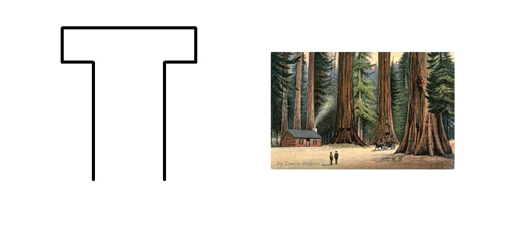
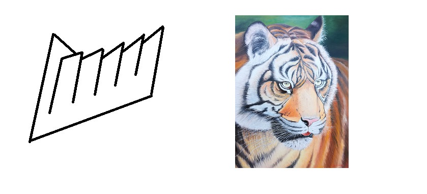
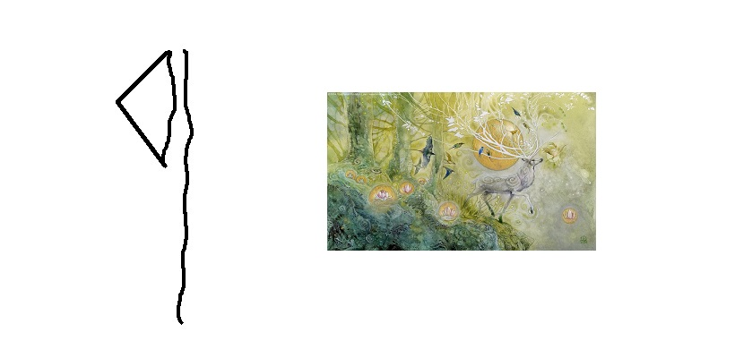
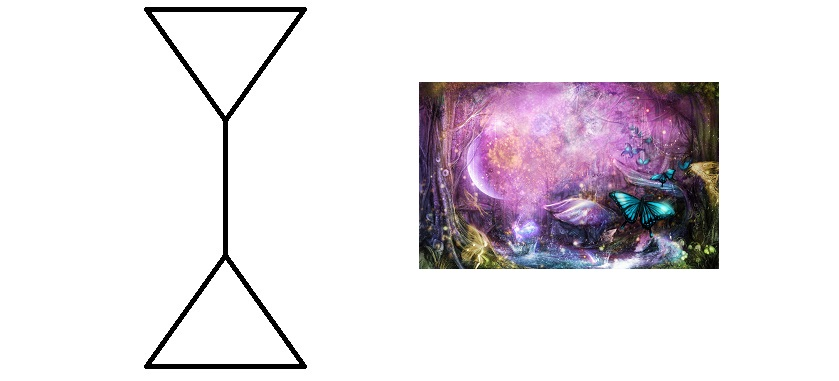
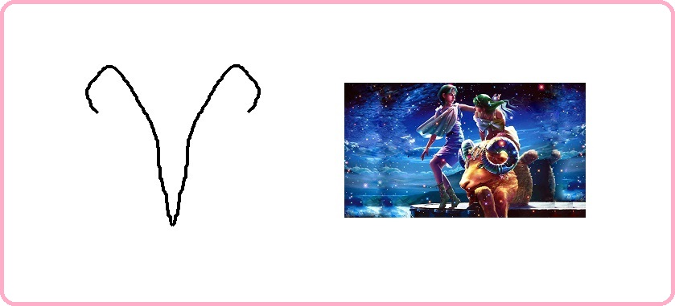
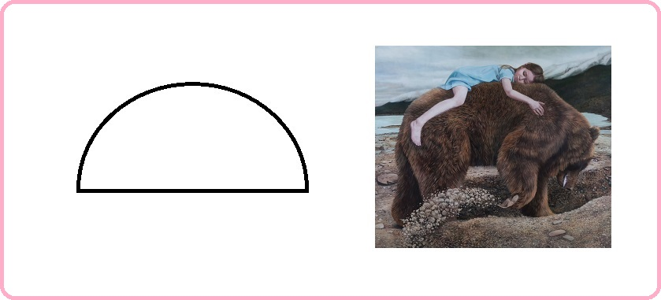

# Благоразумное инвестирование

Я попробую воссоздать биржу труда на основе путёвости людей.

Такое направление будет создавать результат иначе. Например, клавиатура, где буквы у кнопок нажатия динамичны и меняют своё значение при смене раскладки.

> Идеальная политика: многого чего не сделано, будущему поколению есть что продолжить.

Опираться буду на книги Ника Перумова, потому что он пишет про ход времён и подмечает что вечное, а что временное.

---------------------------------

### Проект "Арканы"

Называя в дальнейшем арканы арканами, я имею в виду семейные принципы, за которыми стоят серебрянные схемы мироустройства, которые позволяют быть социализированным, без собственных усилий, проб и ошибок - опираясь на эталон древних создателей (а может быть лишь модификаторов) человека на планету земля. Арканы очень полезны для оптимального восстановления отношений. Ещё одно близкое слово к арканам = светлицы (и днём и ночью).

Возглавляет арканы абсолют аркан-год (в простонародье зовут миром) с 1 ур. вписываемости. 

> Вписываемость это возможность аркану быть встроенным, в выше-стоящий уровня, аркан, для приобретения иного принципа.

Далее идут старшие арканы полугода 2-го уровня, следом главные арканы сезоны 3-го уровня. Потом арканы 12 месяцев с 4-9 уровневой системой вписываемости. 

Арканов для оптимального мироустройства и государственного обустройства - 64. Плюс три аркана смотрящих, находятся за пределами мира.

> По ходу моего личного опыта, будут изменения.

В продолжении темы <a href="./Прототипы/Портативная еда/README.md">портативной еды</a> соберу все арканы и опишу их принципы.

### Абсолют аркан года: путёвость

Описание принципа: без помощников никак.

Наличие в природе: секвойя.

### Старший аркан полугода весны-лета: смышлённость

Описание принципа: никого над нами.

Наличие в природе: тигр.

### Старший аркан полугода осени-зимы: роскошность

Описание принципа: нет необходимости убивать и предавать.

Наличие в природе: олень.

### Главный аркан зимы: обоснование

Описание принципа: дарить подарки это прекрасно!

Наличие в природе: бабочка.

### Главный аркан весны: успех

Описание принципа: попутной волны вам.

Наличие в природе: стрекоза.

### Главный аркан лета: удача

Описание принципа: шёл-шёл, да нашёл.

Наличие в природе: утконос.

### Главный аркан осени: остепенение

Описание принципа: свободу пролетариату.

Наличие в природе: тюлень.

### Главный аркан декабря: признание

Описание принципа: у каждого есть своё предназначение.

Наличие в природе: страус.

### Главный аркан января: перемены

Описание принципа: старое уходит, новое приходит.

Наличие в природе: овца.

### Главный аркан февраля: престиж

Описание принципа: кто заслуживает тот и получит.

Наличие в природе: антилопа.

### Главный аркан марта: партнёр

Описание принципа: у нас будет уединение только у тебя!

Наличие в природе: аист.

### Главный аркан апреля: счастье

Описание принципа: будь собой всегда.

Наличие в природе: лиса.

### Главный аркан мая: деятельность

Описание принципа: будь мудрым в своём устремлении.

Наличие в природе: куропатка.

### Главный аркан июня: одиночество

Описание принципа: правильное суждение.

Наличие в природе: черепаха.

### Главный аркан июля: изоляция

Описание принципа: век живи — век учись тому, как следует жить.

Наличие в природе: ворона.

### Главный аркан августа: отвод

Описание принципа: своих не бросаем.

Наличие в природе: скунс.

### Главный аркан сентября: безопасность

Описание принципа: мы не уступали и никогда не будем уступать.

Наличие в природе: оса.

### Главный аркан октября: смелость

Описание принципа: назад не ходим.

Наличие в природе: кенгуру.

### Главный аркан ноября: хозяйственность

Описание принципа: не рой другому яму а то сам туда упадёшь.

Наличие в природе: медведь.

