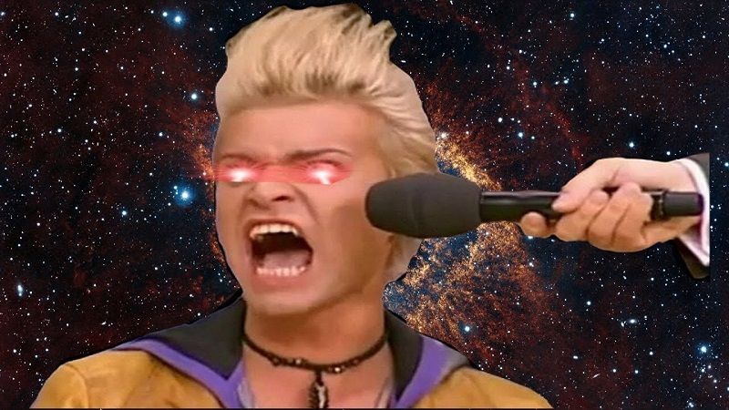
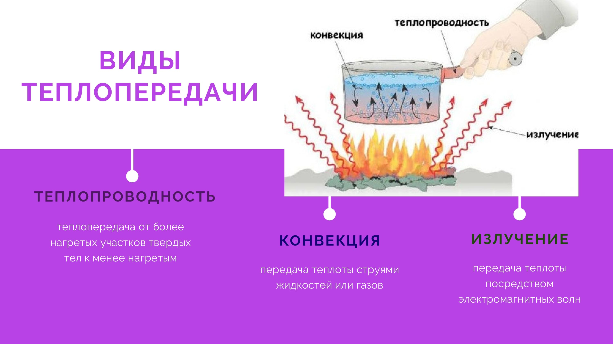
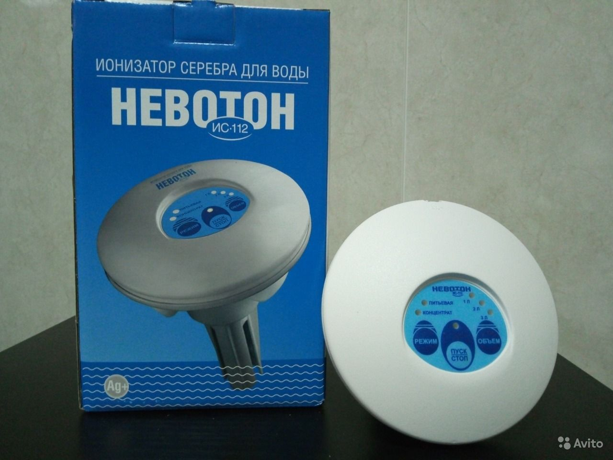
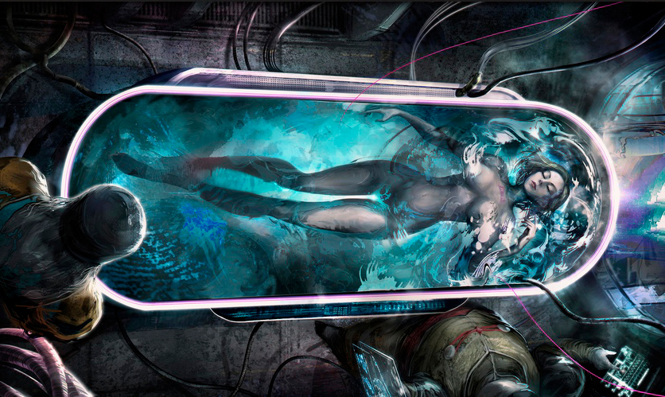
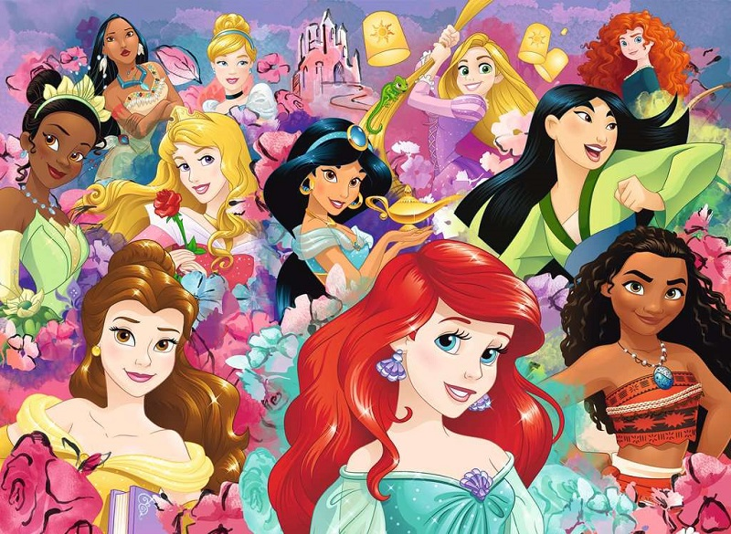

# Благоразумное инвестирование

Я попробую воссоздать биржу труда на основе благоразумия людей:
1. Путёвость
2. Удача

Такое направление будет создавать результат иначе. Например, клавиатура, где буквы у кнопок нажатия динамичны и меняют своё значение при смене раскладки.

> Идеальная политика: многого чего не сделано, будущему поколению есть что продолжить.

Опираться буду на книги Ника Перумова, потому что он пишет про ход времён и подмечает что вечное, а что временное.

---------------------------------

### Проект "Портативная еда"

Я не буду касаться 3-d принтеров создания еды и других технологий, хотя бы потому, что для меня это хоть и крутая, но недоступная зона. Моя территория это выживание, где происходит грамотное использование своих внутренних механизмов: чакр. К сожалению информация про магию перетекла из государств в религию, а те как правило не парные существа, тем самым превратив магию в миф.

Я попытаюсь добраться до "внутреннего трансформатора" материи, который знает как грамотно распределять ресурсы. Для этого я выставлю опоры на пути мага, которых я буду придерживаться до последнего:
- Звуковые вибрации
- Парная чакра солнечного сплетения
- Книги Сергея Тармашева
- Описания трипов под Аяхуаской
- Описания результатов от применения Синтезита

> Мой Мир учит меня тому, чего я хочу!

В продолжении <a href="./Прототипы/Исключение конфликтов/README.md">исключения конфликтов</a> данный репозиторий будет наполняться абзацами с названием "мысль №".

### Мысль №1: Хаос

Когда то я применял аяхуаску, тогда когда она была легальна, и стоила по 150 рублей благодаря США. Она не только обучала работе с чакрами, вытаскивала из проблем, помогала чинить окружающих... но и превратила меня в ходячий материализатор насекомых. В основном мух, они появлялись в самых различных помещениях, даже закрытых, притом доходило до того, что поддоконники были потом усеяны мухами. 

Для самолёта, летящего высоко над землёй, насекомые не стали исключением. Они даже появлялись в бане, а в помывочной пауки плели громадные паутины, при том сами пауки были тоже больших размеров. И ни кому до них не было дела, а если кому и было дело, то они обладали привелегией на землю (но я встретил лишь 2-х таких за всю жизнь). Нередко пауки свисали и в церквях, растопыривали лапы, крутились и поднимались в свою неизвестность.. 

Зима им была не помехой, например макрица в обмороженном помещении могла вылезти из щели и куда то побежать... Кстати и вокруг моего тела появлялся какой то утеплитель. 

Но это ладно, я то пытался найти тот момент: где они постоянно появляются, и понял, <b>они появляются там (оттуда), куда я не смотрю</b>.

### Мысль №2: Порядок

По моему мнению металл является упорядочивателем, или результатом упорядочивания. Поэтому биогенное железо, которое популязируют под маркой "Синтезит", здравое движение. Такое железо будет переводить на порядок отживания (приобретёте бызовые инстинкты безопасности) и защитит от уродского хаоса. У синтезита написан упор на стволовые клетки, но это не то, там идёт самый главный процесс: восстановление теплообмена.

Теплообмен это не передача денег для разрушения текущего государства, и строительство нового, ради какой то там идеи от иуд, а сама суть тактики, влаживаемая в каждую клеточку тела, позволяющее самостоятельно восстанавливать текущее (доводить окружение до нужного состояния, а не зыриться на золотой унитаз Путина). Именно металл задачей теплообмена и занимается, обучая клеточки (вспомнить всё) порядку того уровня, который является металл. Я же предлагаю выйти на <b>биогенное серебро</b>, для перевода клеточек на порядок выживания, превратив тело в магическое для перехода от добычи еды с помощью тяпок и лопат к нечто большему.

### Мысль №3: Область тьмы

Аяхуаска сейчас наркотик, возможно из за побочек в виде галюцинаций или чего нибудь ещё, чего так пугаются иуды на золотых унитазах. Но смысл аяхуаски в том, что там огромнейший концентрат биогенного серебра, да да, там находится ДМТ, который так очень нужен для упорядочивания себя под выживание, это самая лучшая молекула серебра, что я находил. Другие наркотики без металла смысла принимать нет, биогенный металл решает всё. Из легального сейчас осталось оборудование от золотых умов: серебритель воды.

Это как родники с серебром, только в домашних условиях. Но они не очень вытягивают на порядке выживания, то есть с таких аппаратов я так и не смог тело перевести в магическое,  чего то не хватает (уровня влияния?), хоть осеребри воду таким способом до <b>непросветного состояния</b>...

### Мысль №3: Образование

Если возратить образ выживания, то можно вспомнить популизацию орла у Кастанеды. Это оно. Но мы лучше будем придерживаемся более точного образа от Сергея Тармашева: птица феникс.

Эта птица самопожертвования на правое дело с эффектом <b>самовосстановления</b>. А это значит перестать бояться что то потерять, потому что в будущем всё необходимое пребудет.

Этот момент обобщён в книге Сергея Тармашева "Каждому своё" где события развиваются сразу до начала ядерной бомбардировки и после. 
В книге герои применяют такие вещи, как лекарство "Антирад", позволяющее не сразу загнуться от радиации, но имеющий своё страшное побочное действие и "Биорегенератор" позволяющий почти полностью вылечить организм от любых болезней.

### Мысль №4: Вечная загадка

При взаимодействии с моей половинкой начинается бурление в солнечном сплетении, я как понял это так работает интеграция. С другими людьми такого не происходит, хоть и происходит обмен самоотдача-преданность с эффектом благодарности. Вспомнил, как раньше замечал, что там в солнечном сплетении словно билось сердце, эту пульсацию было видно на теле. Это значит теплообмен запущен и работает в норме. Бурление видимо подготовительная стадия.

Здесь я понимаю о развилке пути, одна ведёт в приключения дурака, другая ведёт к мечте. Когда отрекаешься от приключений (и от затворничества, и от ностальгии) и следуешь "зажённой мечте" в своём солнечном сплетении, тогда и начинаешь по настоящему выживать. Мечта будет рядом, мимолётно рядом, сопровождать тебя и твою половинку к себе, пока в конце концов ваши солнечные сплетения не забьются в унисон. По пути у вас будут появлятся помощники, всё больше и больше, насколько получится охватить людей своим работающим солнечным сплетением, как вашим, так и вашей половинкой. Все кто столкнулся с вами будут осознавать что они освобождены от ненужности.

### Мысль №5: Препятствие

Отступлюсь от задуманного и немного впишу Зеланда. У него проблема нашего неблагополучия видится в маятниках. Я их покажу иначе:

И это не просто маятники (богачи раздающие задачи беднякам), а само наследие страны (сгусток нереализованных претензий и наставничеств), накапливающееся из поколения в поколения и наваливающееся на лохов.

### Мысль №6: Единомышление

Для всех всегда свой - это ключ к материализации.

Пример можно наблюдать в виде реакции всех песчинок "Магнитный песок" на магнит. Они становятся одним целым.