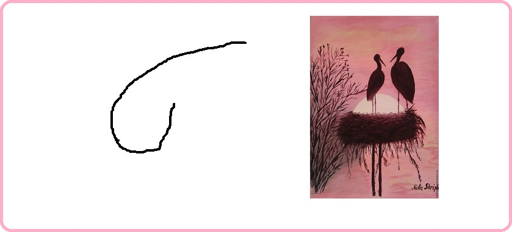
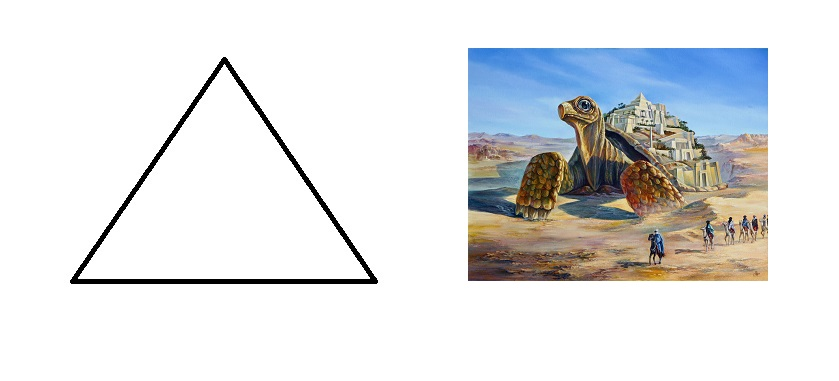
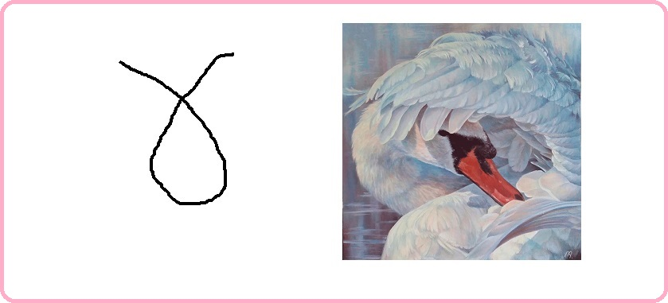
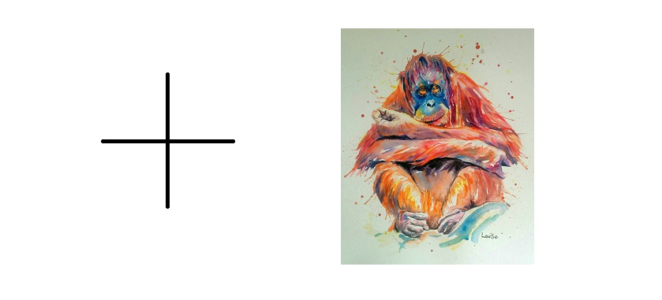
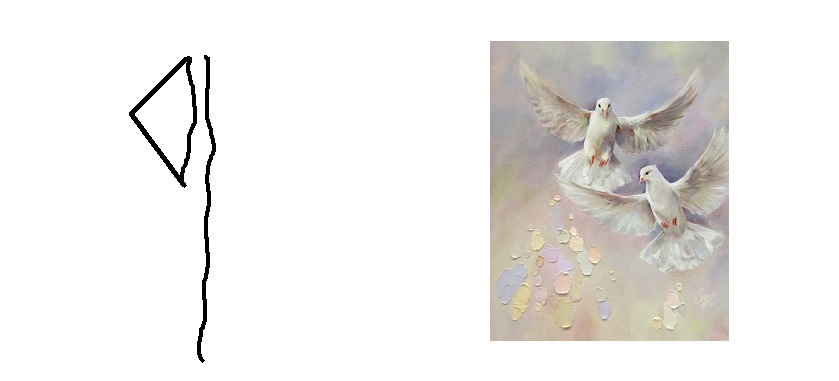

# Благоразумное инвестирование

Я попробую воссоздать биржу труда на основе путёвости людей.

Такое направление будет создавать результат иначе. Например, клавиатура, где буквы у кнопок нажатия динамичны и меняют своё значение при смене раскладки.

> Идеальная политика: многого чего не сделано, будущему поколению есть что продолжить.

Опираться буду на книги Ника Перумова, потому что он пишет про ход времён и подмечает что вечное, а что временное.

---------------------------------

### Проект "Арканы"

Называя в дальнейшем арканы арканами, я имею в виду семейные принципы, за которыми стоят серебрянные схемы мироустройства, которые позволяют быть социализированным, без собственных усилий, проб и ошибок - опираясь на эталон древних создателей (а может быть лишь модификаторов) человека на планету земля. Арканы очень полезны для оптимального восстановления отношений. Ещё одно близкое слово к арканам = светлицы (и днём и ночью).

Возглавляет арканы аркан-год (в простонародье зовут миром) с 1 ур. вписываемости. 

> Вписываемость это возможность аркану быть встроенным, в выше-стоящий уровня, аркан, для приобретения иного принципа.

Далее идут арканы полугода 2-го уровня, следом арканы сезоны 3-го уровня. Потом арканы 12 месяцев с 4-9 уровневой системой вписываемости. 

Арканов для оптимального мироустройства и государственного обустройства - 64. Плюс три аркана смотрящих, находятся за пределами мира.

> По ходу моего личного опыта, будут изменения.

В продолжении темы <a href="./Прототипы/Портативная еда/README.md">портативной еды</a> соберу все арканы и опишу их принципы.

### Заглавный аркан года: обожание

Описание принципа: без помощников никак.

Наличие в природе: белый гриб.

### Главный аркан полугода весны-лета: смышлённость

Описание принципа: никого над нами.

Наличие в природе: тигр.

### Главный аркан полугода осени-зимы: путеводность

Описание принципа: я отведу тебя в самые лучшие места.

Наличие в природе: белка.

### Старший аркан зимы: обоснование

Описание принципа: дарить подарки это прекрасно!

Наличие в природе: бабочка.

### Старший аркан весны: успех

Описание принципа: попутной волны вам.

Наличие в природе: стрекоза.

### Старший аркан лета: удача

Описание принципа: шёл-шёл, да нашёл.

Наличие в природе: утконос.

### Старший аркан осени: остепенение

Описание принципа: свободу пролетариату.

Наличие в природе: тюлень.

### Старший аркан декабря: признание

Описание принципа: у каждого есть своё предназначение.

Наличие в природе: страус.

### Старший аркан января: перемены

Описание принципа: старое уходит, новое приходит.

Наличие в природе: овца.

### Старший аркан февраля: престиж

Описание принципа: кто заслуживает тот и получит.

Наличие в природе: антилопа.

### Старший аркан марта: партнёр

Описание принципа: у нас будет уединение только у тебя!

Наличие в природе: аист.

### Старший аркан апреля: счастье

Описание принципа: будь собой всегда.

Наличие в природе: лиса.

### Старший аркан мая: деятельность

Описание принципа: будь мудрым в своём устремлении.

Наличие в природе: куропатка.

### Старший аркан июня: одиночество

Описание принципа: правильное суждение.

Наличие в природе: черепаха.

### Старший аркан июля: изоляция

Описание принципа: век живи — век учись тому, как следует жить.

Наличие в природе: ворона.

### Старший аркан августа: отвод

Описание принципа: своих не бросаем.

Наличие в природе: скунс.

### Старший аркан сентября: безопасность

Описание принципа: мы не уступали и никогда не будем уступать.

Наличие в природе: оса.

### Старший аркан октября: смелость

Описание принципа: назад не ходим.

Наличие в природе: кенгуру.

### Старший аркан ноября: хозяйственность

Описание принципа: не рой другому яму а то сам туда упадёшь.

Наличие в природе: медведь.

### Средний (или младший) аркан декабря: автономность

Описание принципа: лучше маленькое, но своё, чем большое, но чужое.

Наличие в природе: улитка.

### Средний (или младший) аркан декабря: сбережение

Описание принципа: надо заботиться о будущем поколении.

Наличие в природе: сорока.

### Средний (или младший) аркан декабря: сохранность

Описание принципа: будет ещё.

Наличие в природе: лебедь.

### Средний (или младший) аркан января: распределение

Описание принципа: пожертвуй этим - новое дадим.

Наличие в природе: орангутанг.

### Средний (или младший) аркан января: дальновидность

Описание принципа: предвкушение покажет где твоё.

Наличие в природе: ягуар.

### Средний (или младший) аркан февраль: предусмотрительность

Описание принципа: ноль никогда не станет кем то.

Наличие в природе: паук.

### Средний (или младший) аркан марта: обобщение

Описание принципа: как здорово что вместе мы здесь сегодня собрались.

Наличие в природе: сверчок.

### Средний (или младший) аркан марта: обеспеченность

Описание принципа: нельзя отворачиваться от семьи, даже если она отвернулась от тебя.

Наличие в природе: крот.

### Средний (или младший) аркан марта: отток 

Описание принципа: чтобы прибывало, надо сделать так, чтобы убывало.

Наличие в природе: слон.

### Средний (или младший) аркан апреля: исцеление 

Описание принципа: всё восполнимо.

Наличие в природе: голубь.

### Средний (или младший) аркан мая: стабилизация

Описание принципа: никто не знает что будет завтра.

Наличие в природе: священный скарабей.

### Средний (или младший) аркан мая: примирение 

Описание принципа: один в поле не воин.

Наличие в природе: креветка.

### Средний (или младший) аркан июля: озарение 

Описание принципа: это и трагедия, и комедия.

Наличие в природе: сокол.

### Средний (или младший) аркан июля: единство 

Описание принципа: для кого живёшь - того и кормишь.

Наличие в природе: крокодил.

### Средний (или младший) аркан августа: пресечение 

Описание принципа: мелочей не бывает.

Наличие в природе: сова.

### Средний (или младший) аркан сентября: взаимовыручка 

Описание принципа: впусти меня и я отблагодарю.

Наличие в природе: кальмар.

### Средний (или младший) аркан ноября: чистота 

Описание принципа: нужно обмениваться.

Наличие в природе: касатка.

