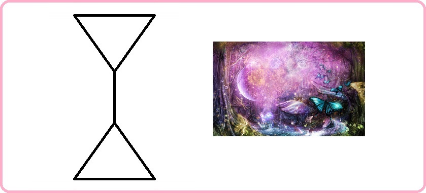

# Благоразумное инвестирование

Я попробую воссоздать биржу труда на основе путёвости людей.

Такое направление будет создавать результат иначе. Например, клавиатура, где буквы у кнопок нажатия динамичны и меняют своё значение при смене раскладки.

> Идеальная политика: многого чего не сделано, будущему поколению есть что продолжить.

Опираться буду на книги Ника Перумова, потому что он пишет про ход времён и подмечает что вечное, а что временное.

---------------------------------

### Проект "Арканы"

За арканами стоит серебрянные схемы, которые позволяют быть социализированным, без собственных усилий, проб и ошибок - опираясь на эталон древних создателей (а может быть лишь модификаторов) человека на планету земля. Арканы очень полезны для оптимального восстановления отношений. Ещё одно близкое слово к арканам = светлицы (и днём и ночью).

Возглавляет арканы абсолют аркан-год (в простонародье зовут миром) с 1 ур. вписываемости. 

> Вписываемость это возможность аркану быть встроенным, в выше-стоящий уровня, аркан, для приобретения иного принципа.

Далее идут старшие арканы полугода 2-го уровня, следом главные арканы сезоны 3-го уровня. Потом арканы 12 месяцев с 4-9 уровневой системой вписываемости. 

Всего арканов 64 для оптимального мироустройства и государственного обустройства. При этом три аркана за пределами мира.

В продолжении темы <a href="./Прототипы/Портативная еда/README.md">портативной еды</a> соберу все арканы и опишу их принципы.

### Абсолют аркан года: путёвость

Описание принципа: Без помощников никак.

### Старший аркан полугода весны-лета: смышлённость

Описание принципа: Никого над нами.

### Старший аркан полугода осени-зимы: роскошность

Описание принципа: Нет необходимости убивать и предавать.

### Главный аркан зимы: обоснование

Описание принципа: Дарить подарки это прекрасно!

### Главный аркан весны: успех

Описание принципа: Волны любви вам.

### Главный аркан лета: удача

Описание принципа: Обожание кругом.

### Главный аркан осени: остепенение

Описание принципа: Свободу пролетариату.

### Главный аркан декабря: признание

Описание принципа: У каждого есть своё предназначение.

### Главный аркан января: перемены

Описание принципа: Старое уходит, новое приходит.

### Главный аркан февраля: престиж

Кто заслуживает тот и получит.

### Главный аркан марта: партнёр

Описание принципа: У нас будет уединение только у тебя!

### Главный аркан апреля: счастье

Описание принципа: Будь собой всегда.

### Главный аркан мая: деятельность

Описание принципа: Будь мудрым в своём устремлении.

### Главный аркан июня: одиночество

Описание принципа: Правильное суждение.

### Главный аркан июля: изоляция

Описание принципа: Век живи — век учись тому, как следует жить.

### Главный аркан августа: отвод

Описание принципа: Своих не бросаем.

### Главный аркан сентября: безопасность

Описание принципа: Мы не уступали и никогда не будем уступать.

### Главный аркан октября: смелость

Описание принципа: Назад не ходим.

### Главный аркан ноября: хозяйственность

Описание принципа: Не рой другому яму а то сам туда упадёшь.

