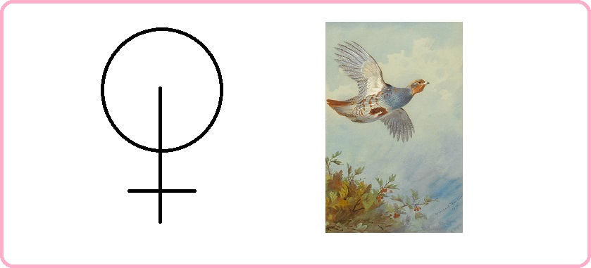

# Благоразумное инвестирование

Я попробую воссоздать биржу труда на основе путёвости людей.

Такое направление будет создавать результат иначе. Например, клавиатура, где буквы у кнопок нажатия динамичны и меняют своё значение при смене раскладки.

> Идеальная политика: многого чего не сделано, будущему поколению есть что продолжить.

Опираться буду на книги Ника Перумова, потому что он пишет про ход времён и подмечает что вечное, а что временное.

---------------------------------

### Проект "Арканы"

Арканы возглавляет абсолют аркан-год (в простонародье зовут его миром) с 1 ур. вписываемости. Далее идут страшие арканы полугода 2-го уровня, следом главные арканы сезоны 3-го уровня. Потом арканы 12 месяцев с 4-9 уровневой системой вписываемости. 

> Вписываемость это возможность одному аркану быть встроенным в другой аркан, для приобретения иного принципа.

Всего арканов 64 для оптимального мироустройства и государственного обустройства. При этом три аркана за пределами мира.

В продолжении темы <a href="./Прототипы/Портативная еда/README.md">портативной еды</a> соберу все арканы и опишу их принципы.

### Абсолют аркан года: путёвость

Век живи — век учись тому, как следует жить.

### Старший аркан полугода весны-лета: смышлённость

Никого над нами.

### Старший аркан полугода осени-зимы: свобода

Никто не знает что будет завтра.

### Главный аркан зимы: чудо

Красота превыше всего.

### Главный аркан весны: успех

Волны любви вам.

### Главный аркан лета: удача

Обожание кругом.

### Главный аркан осени: остепенение

Свободу пролетариату.

### Главный аркан декабря: обояние

Любите друг друга!

### Главный аркан января: господство

Было знание - не было знания, но ключи у нас.

### Главный аркан февраля: престиж

Кто заслуживает тот и получит.

### Главный аркан марта: партнёр

Быть вместе надо вам друзья!

### Главный аркан апреля: счастье

Будь собой всегда.

### Главный аркан мая: деятельность

Будь мудрым в своём устремлении.

### Главный аркан июня: одиночество

Правильное суждение.

### Главный аркан июля: изоляция

Ученье - свет.

### Главный аркан августа: отвод

Своих не бросаем.

### Главный аркан сентября: безопасность

Мы не уступали и никогда не будем уступать.

### Главный аркан октября: смелость

Назад не ходим.

### Главный аркан ноября: хозяйственность

Не рой другому яму а то сам туда упадёшь.

