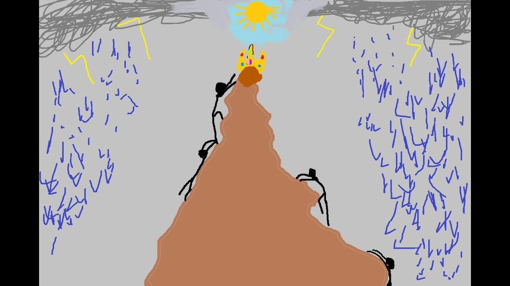
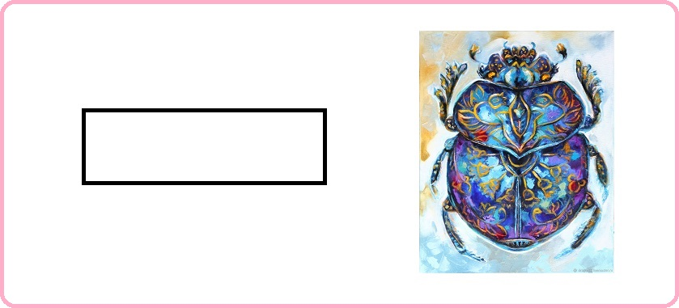
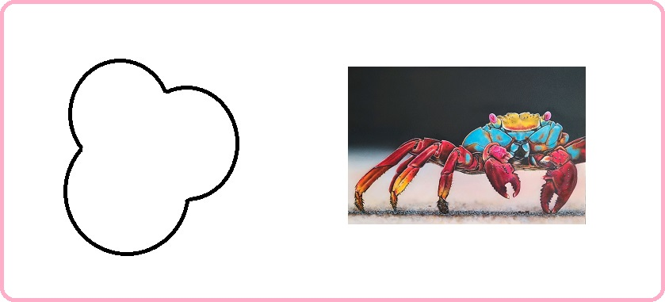
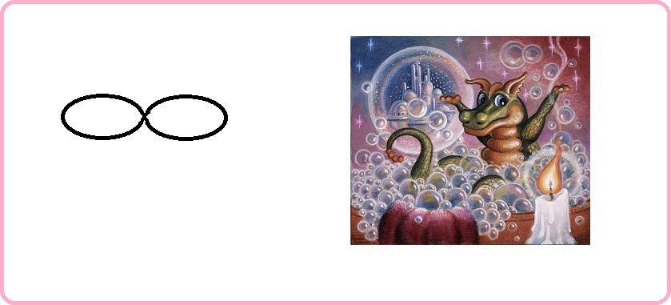
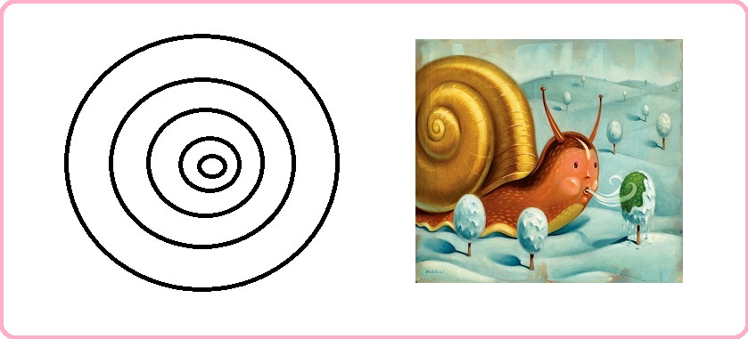
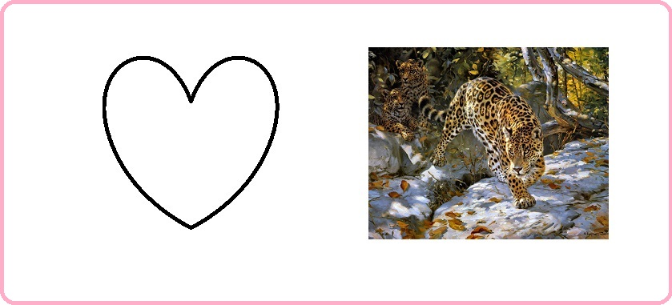

# Благоразумное инвестирование

Я попробую воссоздать биржу труда на основе путёвости людей.

Такое направление будет создавать результат иначе. Например, клавиатура, где буквы у кнопок нажатия динамичны и меняют своё значение при смене раскладки.

> Идеальная политика: многого чего не сделано, будущему поколению есть что продолжить.

Опираться буду на книги Ника Перумова, потому что он пишет про ход времён и подмечает что вечное, а что временное.

---------------------------------

### Проект "Создание привилегий"

Привилегии необходимы для правильных семейных отношений. Отсутствие их порождает стачки.

Под привилегиями я имею в виду семейные принципы, за которыми стоят серебрянные схемы мироустройства, которые позволяют быть социализированным, без собственных усилий, проб и ошибок - опираясь на эталон древних создателей (а может быть лишь модификаторов) человека на планету земля.  Ещё одно близкое слово к привилегиям = светлицы (и днём и ночью).

Возглавляет привилегии привилегия-год (в простонародье зовут миром) с 1 ур. вписываемости. 

> Вписываемость это возможность привилегии нижнего-уровня быть встроенным в привилегию выше-стоящую уровня, для приобретения иного принципа.

Далее идут привилегии полугода 2-го уровня, следом привилегии сезоны 3-го уровня. 

Потом привилегии 12 месяцев с 4-9 уровневой системой вписываемости, где 4-й уроень обозначает выходные (субботы и воскресенья) месяца, а 5-9 уровни идут последовательно как пятедневки.

Привилегий для оптимального мироустройства и государственного обустройства - 64. Плюс три привилегии смотрящих, находятся за пределами мира.

> По ходу моего личного опыта, будут изменения.

В продолжении темы <a href="./Прототипы/Портативная еда/README.md">портативной еды</a> соберу все привилегии и опишу их принципы.

### Заглавная привилегия года: обожание

Описание принципа: хорошо тогда, когда встречают там, куда ты растёшь.

Наличие в природе: белый гриб.

Схема:

### Главная привилегия полугода осени-зимы: путеводность

Описание принципа: я отведу тебя в самые лучшие места.

Наличие в природе: белка.

Схема:

### Главная привилегия полугода весны-лета: смышлённость

Описание принципа: никого над нами.

Наличие в природе: тигр.

Схема:

### Старшая привилегия зимы: обоснование

Описание принципа: дарить подарки это прекрасно!

Наличие в природе: бабочка.

Схема:

### Старшая привилегия весны: успех

Описание принципа: попутной волны вам.

Наличие в природе: стрекоза.

Схема:

### Старшая привилегия лета: удача

Описание принципа: шёл-шёл, да нашёл.

Наличие в природе: утконос.

Схема:

### Старшая привилегия осени: остепенение

Описание принципа: свободу пролетариату.

Наличие в природе: тюлень.

Схема:

### Старшая привилегия февраля: престиж

Описание принципа: кто заслуживает тот и получит.

Наличие в природе: антилопа.

Схема:

### Старшая привилегия марта: партнёр

Описание принципа: у нас будет уединение только у тебя!

Наличие в природе: аист.

Схема:

### Старшая привилегия апреля: счастье

Описание принципа: будь собой всегда.

Наличие в природе: лиса.

Схема:

### Старшая привилегия мая: деятельность

Описание принципа: будь мудрым в своём устремлении.

Наличие в природе: куропатка.

Схема:

### Старшая привилегия июня: укрепление

Описание принципа: плохому от ворот поворот.

Наличие в природе: черепаха.

Схема:

### Старшая привилегия июля: статность 

Описание принципа: не ищи смысла там где его нет.

Наличие в природе: ворона.

Схема:

### Старшая привилегия августа: ошалелость

Описание принципа: опаздунов не ждём.

Наличие в природе: скунс.

Схема:

### Старшая привилегия сентября: безопасность

Описание принципа: мы не уступали и никогда не будем уступать.

Наличие в природе: оса.

Схема:

### Старшая привилегия октября: смелость

Описание принципа: назад не ходим.

Наличие в природе: кенгуру.

Схема:

### Старшая привилегия ноября: хозяйственность

Описание принципа: не рой другому яму а то сам туда упадёшь.

Наличие в природе: медведь.

Схема:

### Старшая привилегия декабря: лаконичность 

Описание принципа: хорошо жить не запретишь.

Наличие в природе: олень.

Схема:

### Старшая привилегия января: перемены

Описание принципа: старое уходит, новое приходит.

Наличие в природе: овца.

Схема:

### Средняя (или младшая) привилегия февраля: предусмотрительность

Описание принципа: ноль никогда не станет кем то.

Наличие в природе: паук.

Схема:

### Средняя (или младшая) привилегия февраля:  продуманность

Описание принципа: это чтобы не упал.

Наличие в природе: лошадь.

Схема:

### Средняя (или младшая) привилегия февраля: превосходство

Описание принципа: со мной будет везти.

Наличие в природе: павлин.

Схема:

### Средняя (или младшая) привилегия февраля: осведомление

Описание принципа: надо заботиться о будущем поколении.

Наличие в природе: сорока.

Схема:

### Средняя (или младшая) привилегия марта: обобщение

Описание принципа: как здорово что вместе мы здесь сегодня собрались.

Наличие в природе: сверчок.

Схема:

### Средняя (или младшая) привилегия марта: обеспеченность

Описание принципа: нельзя отворачиваться от семьи, даже если она отвернулась от тебя.

Наличие в природе: крот.

Схема:

### Средняя (или младшая) привилегия марта: отток 

Описание принципа: чтобы прибывало, надо сделать так, чтобы убывало.

Наличие в природе: слон.

Схема:

### Средняя (или младшая) привилегия апреля: сбережение 

Описание принципа: всё восполнимо.

Наличие в природе: голубь.

Схема:

### Средняя (или младшая) привилегия мая: стабилизация

Описание принципа: никто не знает что будет завтра.

Наличие в природе: священный скарабей.

Схема:

### Средняя (или младшая) привилегия мая: примирение 

Описание принципа: один в поле не воин.

Наличие в природе: креветка.

Схема:

### Средняя (или младшая) привилегия июня: щедрость 

Описание принципа: со мной всё получится.

Наличие в природе: щука.

Схема:

### Средняя (или младшая) привилегия июня: укрытие 

Описание принципа: попадут туда, где нас нет.

Наличие в природе: краб.

Схема:

### Средняя (или младшая) привилегия июня: единство 

Описание принципа: для кого живёшь - того и кормишь.

Наличие в природе: крокодил.

Схема:

### Средняя (или младшая) привилегия июня: расторопность 

Описание принципа: ложи всё по правильным местам.

Наличие в природе: колорадский жук.

Схема:

### Средняя (или младшая) привилегия июля: озарение 

Описание принципа: это и трагедия, и комедия.

Наличие в природе: сокол.

Схема:

### Средняя (или младшая) привилегия июля: состоятельность 

Описание принципа: жизнь хороша когда пьёшь не спеша.

Наличие в природе: бобёр.

Схема:

### Средняя (или младшая) привилегия июля: галантность 

Описание принципа: подстрахуем - не дрейфь.

Наличие в природе: волк.

Схема:

### Средняя (или младшая) привилегия августа: пресечение 

Описание принципа: мелочей не бывает.

Наличие в природе: сова.

Схема:

### Средняя (или младшая) привилегия августа: обособленность

Описание принципа: быть там где нас не ждут.

Наличие в природе: скорпион.

Схема:

### Средняя (или младшая) привилегия сентября: взаимовыручка 

Описание принципа: впусти меня и я отблагодарю.

Наличие в природе: кальмар.

Схема:

### Средняя (или младшая) привилегия сентября: насыщение 

Описание принципа: принять чтобы дать.

Наличие в природе: муравей.

Музыка: prodigy.

Схема:

### Средняя (или младшая) привилегия октября: цепкость 

Описание принципа: глаз алмаз.

Наличие в природе: горный козёл.

Схема:

### Средняя (или младшая) привилегия ноября: стяг 

Описание принципа: нужно обмениваться.

Наличие в природе: касатка.

Схема:

### Средняя (или младшая) привилегия ноября: корректировка 

Описание принципа: влаживай средства туда, где окупаемо.

Наличие в природе: лягушка.

Музыка: pikotaro.

Схема:

### Средняя (или младшая) привилегия декабря: автономность

Описание принципа: всё наше при себе.

Наличие в природе: улитка.

Схема:

### Средняя (или младшая) привилегия декабря: сохранность

Описание принципа: будет ещё.

Наличие в природе: лебедь.

Схема:

### Средняя (или младшая) привилегия декабря: признание

Описание принципа: у каждого есть своё предназначение.

Наличие в природе: страус.

Схема:

### Средняя (или младшая) привилегия декабря: милота

Описание принципа: работать надо по касательной.

Наличие в природе: заяц.

Схема:

### Средняя (или младшая) привилегия января: приличие

Описание принципа: делитесь только с друзьями.

Наличие в природе: орангутанг.

Схема:

### Средняя (или младшая) привилегия января: дальновидность

Описание принципа: предвкушение покажет где твоё.

Наличие в природе: ягуар.

Схема:

### Средняя (или младшая) привилегия января: становление

Описание принципа: опора наше всё.

Наличие в природе: щегол.

Схема:

### Средняя (или младшая) привилегия января: обновление

Описание принципа: только замена.

Наличие в природе: снегирь.

Схема:

