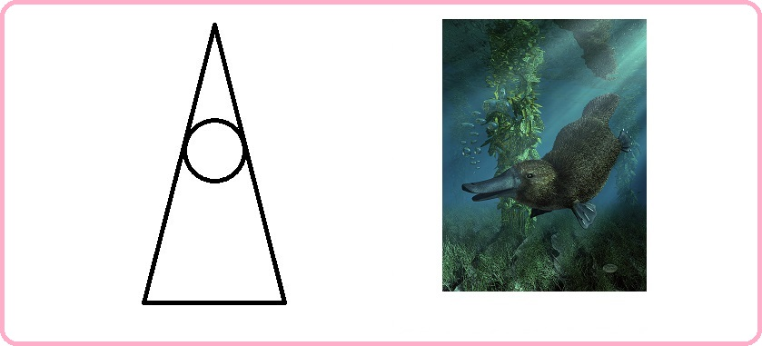

# Благоразумное инвестирование

Я попробую воссоздать биржу труда на основе благоразумия людей:
1. Путёвость
2. Удача

Такое направление будет создавать результат иначе. Например, клавиатура, где буквы у кнопок нажатия динамичны и меняют своё значение при смене раскладки.

> Идеальная политика: многого чего не сделано, будущему поколению есть что продолжить.

Опираться буду на книги Ника Перумова, потому что он пишет про ход времён и подмечает что вечное, а что временное.

---------------------------------

### Проект "Арканы"

Арканы возглавляют 4 сезона, это основополагающие арканы. Далее следуют арканы 12 месяцев с 5 уровневой системой. Всего их 64.

В продолжении темы <a href="./Прототипы/Портативная еда/README.md">портативной еды</a> соберу все арканы и опишу их принципы.

### Главный аркан зимы: чудо

Красота превыше всего.

### Главный аркан весны: успех

Волны любви вам.

### Главный аркан лета: удача

Обожание кругом.

