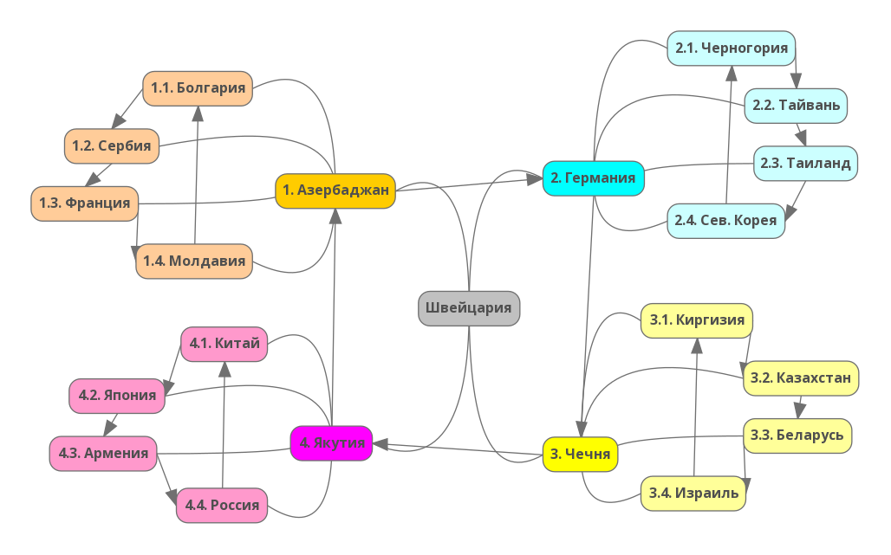

# Благоразумное инвестирование

Я попробую воссоздать биржу труда на основе благоразумия людей:
1. Путёвость
2. Удача

Такое направление будет создавать результат иначе. Например, клавиатура, где буквы у кнопок нажатия динамичны и меняют своё значение при смене раскладки.

> Идеальная политика: многого чего не сделано, будущему поколению есть что продолжить.

Опираться буду на книги Ника Перумова, потому что он пишет про ход времён и подмечает что вечное, а что временное.

---------------------------------

### Проект "Исключение конфликтов"

В связи с разрушительной "российской спец. операцией 2022" проанализирую кто виноват и что с этим делать.

Для начала обозначу что эту спец. операцию могли лишь протолкнуть: семейный люди, имеющие детей. Так как "ради Бога" у нас не живут, будем считать что всё для "будущего наших детей".

### Кто?

Обратимся к прошлой деятельности, где при создании-образовании стран, эти семейные люди влаживали идею. Так как Россия это страна убогих, то нужно искать самую обиженную семейную пару, которую жалели остальные люди, отдав все права на создание идеи. Если хорошо проанализировать, это самая обиженная была Ванга и его малахольный ухажёр.

Но Ванга умерла, а наследника её убогости так и не нашли. Но идея то до сих пор крепко витает, даже американцы попавшие в плен начинают лепетать про: вечную жизнь. Вывод: Ванга посредник.

Если хорошо покопаться в этой идее, то находишь её сформулированную обработанную версию из религии "Теософии". Смысл примерно таков: собираем всё в кучу, так мы добьёмся единства. То есть они предлагают гнилую картошку держать со здоровой. Ну так себе идея, хотя для наркоманов это что то да значит.

### Где?

Начинаем анализ различных путей "Теософии" - натыкаемся постоянно на Швейцарию, штаб там, как и общак воровской. Понятно какой религии был жалкий Ленин.

Если дальше проанализировать методику, выходя за грани "поимки людей на жалость" натыкаемся на притеснение. То есть чтобы страну подчинить себе - они устраивали там геноцид, а потом ставили там власть в виде бандитов из других стран.

Естественно вороство быстро губит всё, поэтому они оставляли здравомыслящих, чтобы те поддерживали страну в пригодном состоянии, в виде обслуги. На данный момент костяк "Теософии" выявил в виде таких их стран (где есть обслуга):

### Зачем?

Без страны воры никто, ибо сами ничего делать не умеют, не хватает квалификации. Для своей деятельность им нужно чтобы люди в стране создавали для них нужную им энергетику, и не нужную для человечества. Поэтому самая главная энергия, в которой религия нуждается: это напрасность. Швейцария это главная страна где бьёт некрофильский родник "напрасности". 

Дальше нужна симуляция управления. И чтобы напрасность не разрушать, воссоздали такие энергии:
1. Превосходство - аналог нашей жизни, базис в Азербаджане.
2. Сопротивление - аналог нашей гармонии, базис в Германии.
3. Зависть - аналог нашей любви, базис в Чечне.
4. Ненависть - аналог нашей дружбы, базис в Якутии.

### Как?

Действуют "они" и их последователи с помощью стереотипов. Это аналог идеи, только уже недоговорного и несогласующегося характера. То есть вопреки всем человеческим ожиданиям. 

Принявший стереотип навсегда парализует свою волю.

