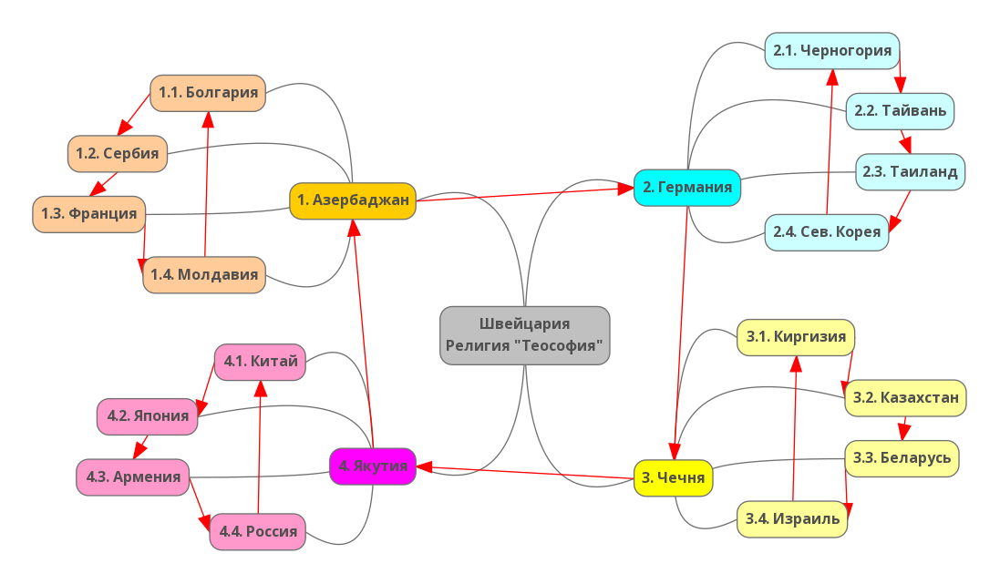

# Благоразумное инвестирование

Я попробую воссоздать биржу труда на основе путёвости людей.

Такое направление будет создавать результат иначе. Например, клавиатура, где буквы у кнопок нажатия динамичны и меняют своё значение при смене раскладки.

> Идеальная политика: многого чего не сделано, будущему поколению есть что продолжить.

Опираться буду на книги Ника Перумова, потому что он пишет про ход времён и подмечает что вечное, а что временное.

---------------------------------

### Проект "Исключение конфликтов"

В связи с разрушительной "российской спец. операцией 2022", оперевшись на <a href="/Прототипы/Основы планирования/README.md">Основы планирования</a>, проанализирую кто виноват и что с этим делать.

Для начала обозначу что эту спец. операцию могли лишь протолкнуть: семейный люди, имеющие детей. Так как "ради Бога" у нас не живут, будем считать что всё это для "будущего наших детей".

### Кто?

Обратимся к прошлой деятельности, где при создании-образовании стран, эти семейные люди влаживали идею. Так как Россия это страна убогих, то нужно искать самую обиженную семейную пару, которую жалели остальные люди, отдав все права на создание идеи. Если хорошо проанализировать, то самая обиженная была Ванга и его малахольный ухажёр.

Но Ванга умерла, а наследника её убогости так и не нашли. Но идея то до сих пор крепко витает, даже американцы попавшие в плен болот России начинают лепетать про: вечную жизнь. Вывод: Ванга посредник.

Если хорошо покопаться в этой идее, то находишь её сформулированную обработанную версию из религии "Теософии". Смысл примерно таков: собираем всё в кучу, так мы добьёмся единства. То есть они предлагают гнилую картошку держать со здоровой. Ну так себе идея, хотя для наркоманов это что то да значит.

### Где?

Начинаем анализ различных путей "Теософии" - натыкаемся постоянно на Швейцарию, штаб там, как и общак воровской. Понятно какой религии был жалкий Ленин.

Если дальше проанализировать методику, выходя за грани "поимки людей на жалость" натыкаемся на притеснение. То есть чтобы страну подчинить себе - они устраивали там геноцид, а потом ставили там власть в виде бандитов из других стран.

Естественно вороство быстро губит всё, поэтому они оставляли здравомыслящих, чтобы те поддерживали страну в пригодном состоянии, в виде обслуги. На данный момент я выявил костяк "Теософии" в виде таких их стран (где есть обслуга):

### Зачем?

Без страны изгои никто, ибо сами ничего делать не умеют, не хватает квалификации. Для своей деятельность им нужно чтобы люди в стране создавали для них нужную им энергетику, и не нужную для человечества. Поэтому самая главная энергия, в которой религия нуждается, то это энергия змеи (антипринцип трансгендер). Швейцария это главная страна где бьёт некрофильский источник "гипноза и зомбирования" 🐍. 

Дальше нужна симуляция управления. И чтобы трансгендерность не разрушать, воссоздали такие энергии защиты:
1. Энергия собаки (антипринцип агрессия) - базис в Азербаджане, супротив нашей жизни.
2. Энергия гуся (антипринцип скупость) - базис в Германии, супротив нашей гармонии.
3. Энергия кота (антипринцип садомаза) - базис в Чечне, супротив нашей любви.
4. Энергия свиньи (антипринцип канибализм) - базис в Якутии, супротив нашей дружбы.

Дополнительные страны играют роль предохранителя в виде стыда:
1. Педерастия
2. Педофилия
3. Зоофилия
4. Инцест
5. Уринотерапия
6. Наркомания

### Как?

Действуют "они" и их последователи с помощью стереотипов. Это аналог идеи, только уже недоговорного и несогласующегося характера. То есть вопреки всем человеческим ожиданиям. 

Принявший стереотип навсегда парализует свою волю. Например стереотип "не умеешь - не берись" (нормально = каждый сверчёк - знай свой шесток).

### Что?

Вы наверно подумали (из за стереотипов) что это легионы смерти и т.д. Но нет, это всего лишь последствие поломок и неспособность рядом находящихся оказать квалифицированную помощь. Ну ещё есть неуловимое следствие, которое ушло в прошлое.. Но таких следствий у каждого может быть по нескольку штук.

И самое тут трагичное и разрушительное - это неспособность растаться с умершими близкими или по другому нехватка адаптации к переменам. Включается автопилот "самоутверждения", который с каждым новым днём начинает брать на себя не свойственные функции, пытаясь подменить "ушедшего".

### Решение проблемы.

Мы не знаем что нас ждёт завтра, можем только предположить. Хорошее приятно предполагать, но это предположение не подготовит нас к возможной вариации ЧП, которые происходят в независимости от нас.

Если хорошо подумать, то главная подготовка это сохранить своё тело в целостности и сохраности, в особенности мозговой функционал когда есть высокопоставленная должность. Для сохранности нам потребуется основа:
1. тепло
2. кислород
3. вода
4. еда

Из опыта текущих технологий (парентеральное питание) в еду можно вложить первые 3 элемента и выработать оборудование (закономерный метод добычи) такой еды, который станет опорой на время ЧП без замедлений. На деле нужно найти какой то ещё неизвестный "энтеогенный напиток" размером с капсулу, оптимально выводящий из самоутверждения и выстраивающий благоприятный путь к восстановлению, учитывая отступления и различные побочки. Ну это на светлое будущее.

А чтобы решить проблему насущную, то нужно устранить весь <b>диссонанс</b> в семьях на высокопоставленных должностях с помощью психотерапевтов. Их безумные принципы начали воплощаться вовне касаясь тех, кого касаться это не должно было.