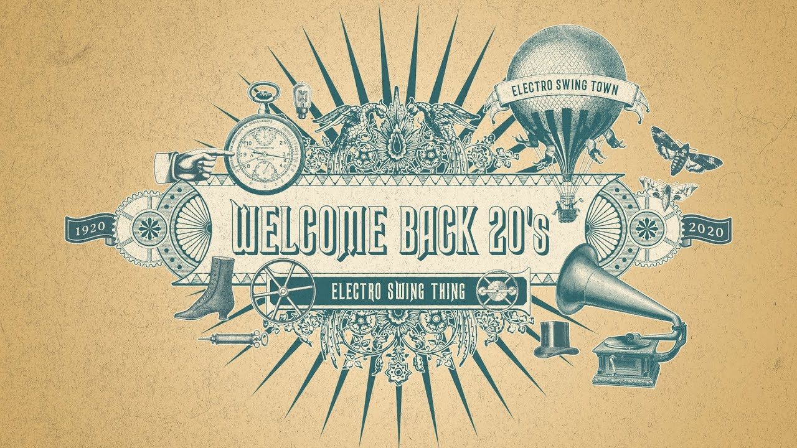

# Благоразумное инвестирование

Я попробую воссоздать биржу труда на основе путёвости людей.



Такое направление будет создавать результат иначе. Например, клавиатура, где буквы у кнопок нажатия динамичны и меняют своё значение при смене раскладки.

> Идеальная политика: многого чего не сделано, будущему поколению есть что продолжить.

Опираться буду на книги Ника Перумова, потому что он пишет про ход времён и подмечает что вечное, а что временное.

---------------------------------

### Проект "Основы планирования"

Начнём грамотную эволюцию от обезъяны к интеллигенции работающей с виртуализацией!


По ходу придумывания, данный репозиторий будет наполняться этапами.

### Этап эволюции №1: Качества

"Разделяй и властвуй" - все говорят, но только некоторые богатые. Вывод? Кто продаёт нужные товары - у того и финансовая структура, а кто не продаёт нужного - тот злой и босоногий.


Выводим востребованные качества:
- Женская щедрость
- Женская значимость
- Мужское остепенение
- Мужской позитив

### Этап эволюции №2: Назначение

Со временем человечество наглоталось непослушания и решила, что хватит, и придумала некий стандарт, которого ниже опускаться нельзя, иначе беда. Назовёт такое предостережение назначением. С помощью назначения мы можем вводить в бизнес деятельность людей и образовывать квалифицированных специалистов.


Выводим качественные назначения:
```diff
               1. Виртуальность / политика
            1.1. Аналитика / школа мастерства
       1.1.1. Строительство / бизнес
1.1.1.1. Банк / бухгалтерия
1.1.1.2. Товар / рынок
1.1.1.3. Рутина / обеспечение
1.1.1.4. Перевозка / логистика
```

### Этап эволюции №3: Размеренность

Чтобы не свернуть в своём деле не туда и не потеряться, из-за недостатка или перегруженности, нужна выверенная мера потребления и отдачи.


Выводим назначенную размеренность:

> от большего всеохвата к местячковому охвату

```diff
1. Обожествление
    2. Справедливость
       3. Хитрость
          4. Синтез
```

### Этап эволюции №4: Востребованность

Время лечит, со временем забудем - мы уже давно про это знаем. Сейчас и учённые занимаются им, назвав время фракталом, а некоторые даже успели его оседлать создав летающие гравицапы. 

В нашем положении мы нацеливаемся на главное, на то, что будет итогом: созданное время, а точнее: благополучные дни. 

У времени для человека есть три точки опоры: прошлое, настоящее и будущее. Прошлое, это то что не поменять? однозначно нет, прошлое это то на что будем опираться. Будущее это изменчивая константа, которая предвещает изменения, и мы пытаемся это новое понять. Настоящее же это точка подпитки, сдесь мы набираем жирок.

Так же мы знаем что у времени есть зоны влияния: весна, лето, осень и зима. И они чередуются. Вместе с чередой у нас три точки опоры так же смещаются, центрируясь настоящим в текущей зоне влияния.


Выводим размеренную востребованность:
- Лето создаёт бизнес.
- Осень подключает новых людей к бизнесу.
- Зима оптимизирует бизнес.
- Весна делает работу в бизнесе.

### Этап эволюции №5: План

План это стержень, который будет нанизывать вышеописанные этапы эволюции в заданом планом направлении. У нас направление "каждому по виртуальному миру", естественно это должно войти на ура, без конфликтов и унижений достоинств приматов. То есть работаем на дополнение текущего (чего не хватает), вводя эффективность, а для хороших мест и оптимальность.

<b>Первое</b> что задаём в плане это местоположение (город, посёлок, деревня, и другое узаконенное в стране автономное объединение). Если вы планируете переезд, отмечаете текущее местоположение и дальнейшие местоположения, в которых будете останавливаться.

<b>Вторым</b> пунктом определяете личные потребности в такой зависимости (как матрёшку собирать):
```
1) ваш представитель (инициалы, контакты) противоположного вам пола
1.1) адрес представителя (жилое, рабочее, для отдыха)
1.1.1) инструменты
1.1.1.1) продукты (кол-во)
```

<b>Третьим</b> пунктом определяем ценность каждой потребности:
```
1) стоимость (заёмный - отдаём деньги, свой - принимаем)
1.1) срок (цикличный, разово, промежуток)
1.1.1) представитель (инициалы, контакты) для сделки
1.1.1.1) адрес (жилое, рабочее, для отдыха)
```

Пример:

